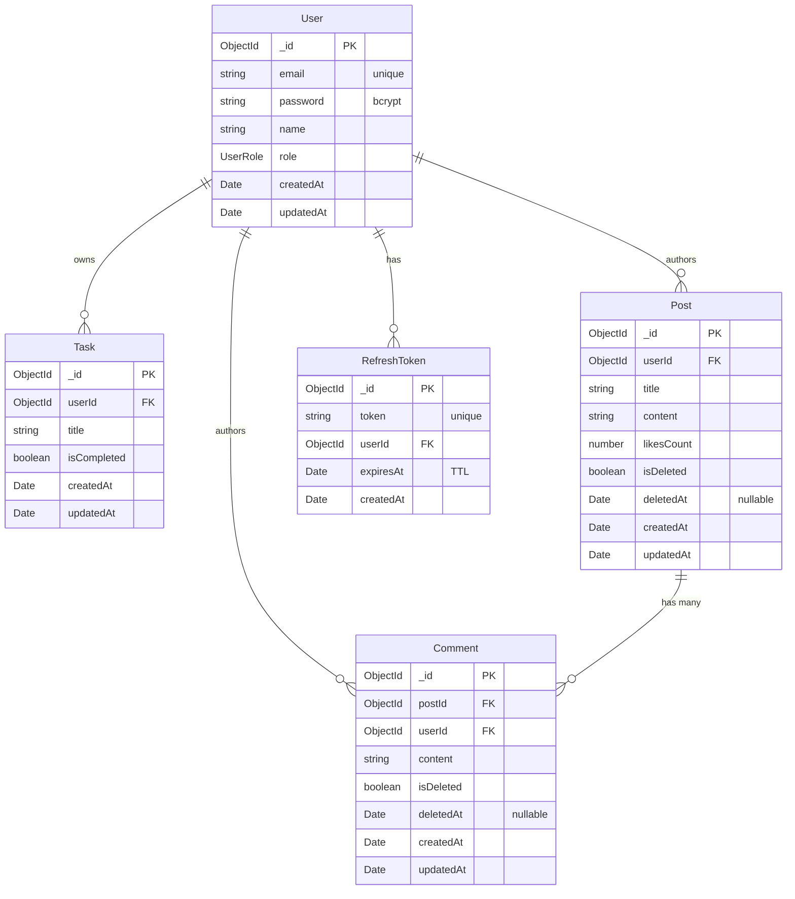

[](https://github.com/nadavramon/server/actions/workflows/ci.yml)

# server

A TypeScript + Express REST API with JWT auth and MongoDB persistence via Mongoose. Manages users, tasks, and a blog system (posts, comments, likes) with soft-delete support.

## Tech stack

- **Node.js** ≥ 24 (`tsx` for dev, `tsc` for production builds)
- **Express 5** for HTTP routing
- **Mongoose 9** for all data access (users, tasks, posts, comments, refresh tokens)
- **JWT** access + refresh tokens; refresh tokens persisted with a TTL index for auto-cleanup
- **Zod** for request DTO validation
- **Vitest** for tests

## Getting started

### Prerequisites

- Node.js 24+
- A running MongoDB instance (local or remote)

### Setup

```bash
npm install
cp .env.example .env/.env.dev   # then fill in real values
npm run dev
```

The server boots on `http://localhost:3000`. Hit `GET /health` to confirm it's up. Swagger UI is at `/api-docs`.

### Environment variables

See [.env.example](./.env.example). All four are required.

| Variable               | Purpose                        |
| ---------------------- | ------------------------------ |
| `PORT`                 | HTTP port                      |
| `JWT_SECRET`           | Signing key for access tokens  |
| `REFRESH_TOKEN_SECRET` | Signing key for refresh tokens |
| `MONGODB_URI`          | Mongo connection string        |

## Scripts

| Command                | What it does                       |
| ---------------------- | ---------------------------------- |
| `npm run dev`          | Start with hot-reload (tsx watch)  |
| `npm run build`        | Compile to `dist/`                 |
| `npm start`            | Run compiled output                |
| `npm run start:prod`   | Run compiled output with .env.prod |
| `npm run typecheck`    | `tsc --noEmit`                     |
| `npm test`             | Vitest run                         |
| `npm run test:watch`   | Vitest watch mode                  |
| `npm run format`       | Prettier write                     |
| `npm run format:check` | Prettier check (CI)                |

## Project structure

```
src/
  app.ts                   # Express app + middleware + routes
  index.ts                 # boot + graceful shutdown
  modules/
    auth/                  # register, login, refresh, logout
    user/                  # users
    task/                  # tasks (todos)
    post/                  # blog posts (CRUD + like, soft-delete)
    comment/               # comments on posts (CRUD, soft-delete with cascade)
    mail/                  # welcome-mail queue: publisher, consumer, idempotent service, mailer
  shared/
    config/                # env loader, Mongoose connection
    middlewares/           # auth, rate limiter, error handler, http logger
    errors/                # AppError hierarchy
    utils/                 # logger, swagger, validate
    types/                 # Express type augmentation
db/
  queries.mongodb          # Studio 3T IntelliShell snippets
```

Each `modules/<name>/` folder follows the same layout: `<name>.ts` (domain types), `<name>Schema.ts` (Mongoose schema), `<name>Model.ts` (async data access + mapper), `<name>Service.ts` (business logic), `<name>Controller.ts` (HTTP handlers), `<name>Routes.ts` (route wiring), `<name>.dto.ts` (Zod request shapes).

## Data model



### Relationships

| Direction             | FK field | Cardinality         | Notes                                               |
| --------------------- | -------- | ------------------- | --------------------------------------------------- |
| `Task → User`         | `userId` | 1 user : N tasks    | Tasks are private — only the owner sees them        |
| `Post → User`         | `userId` | 1 user : N posts    | Author                                              |
| `Comment → User`      | `userId` | 1 user : N comments | Author                                              |
| `Comment → Post`      | `postId` | 1 post : N comments | Comments cascade-soft-delete with their parent post |
| `RefreshToken → User` | `userId` | 1 user : N tokens   | Multiple active sessions per user                   |

### Indexes

| Collection     | Index                                             | Purpose                                                |
| -------------- | ------------------------------------------------- | ------------------------------------------------------ |
| `Comment`      | `{ postId: 1, createdAt: -1 }` (compound)         | Serves "newest comments per post" via index scan       |
| `RefreshToken` | `{ token: 1 }` (unique)                           | Prevents duplicate tokens, fast lookup by token        |
| `RefreshToken` | `{ expiresAt: 1 }` (TTL, `expireAfterSeconds: 0`) | Mongo's background sweeper auto-deletes expired tokens |

### Soft-delete model

`Post` and `Comment` use a two-field soft-delete pattern:

- `isDeleted: boolean` (default `false`) — the source of truth for visibility. All reads filter `{ isDeleted: false }` explicitly.
- `deletedAt: Date | null` (default `null`) — audit timestamp, set when the document is soft-deleted.

When a `Post` is soft-deleted, `postService.deletePost` also runs `commentModel.softRemoveByPostId` — `updateMany` on all live comments under that post, in one batched operation. Both layers hide together, no orphans.

`Task` uses the same two fields (see [Task cleanup (cron)](#task-cleanup-cron) below). `User` and `RefreshToken` use **hard-delete** (no soft-delete fields).

## Welcome mail (queue)

New sign-ups get a welcome email, delivered asynchronously through RabbitMQ so the HTTP request never waits on (or fails because of) SMTP.

### Dev services

```bash
docker compose up -d   # redis + rabbitmq (UI at :15672, guest/guest) + mailpit (inbox at :8025)
```

Mailpit is a local SMTP sink — mails land in its web inbox at <http://localhost:8025> instead of going anywhere real.

### End-to-end flow

1. Sign-up completes → better-auth's `user.create.after` hook fires.
2. `welcomeMail.publisher` publishes `{ userId, email, name }` to the durable `welcome.email` queue — persistent delivery on a confirm channel, and it swallows all errors so sign-up can never fail because the broker is down.
3. The consumer (`prefetch(1)`) hands each message to the idempotent `processWelcomeMessage`, which sends via nodemailer → Mailpit.
4. The message is **acked only after the send succeeds**. Transient failures (SMTP down) → `nack(requeue: true)`, bounded by an attempts counter (max 5). Poison messages (bad JSON, invalid shape, attempts exhausted) → `nack(requeue: false)` → fanout DLX → `welcome.email.dlq` for inspection.

### Why effectively-once

RabbitMQ only guarantees **at-least-once** delivery — a redelivery after a crash or requeue is always possible. Exactly-once therefore lives in the consumer: each message upserts a dedup document keyed on `userId` (unique index in Mongo), and a doc already in `status: 'sent'` makes the redelivery a no-op skip. At-least-once transport + idempotent consumer = effectively exactly one mail per user.

## Task cleanup (cron)

Completed todos don't pile up forever: a nightly job soft-deletes any task that has been completed for **7 days**.

### Retention rule

- Cleanup sets `isDeleted: true` + `deletedAt` — the same two-field soft-delete pattern as `Post`/`Comment`. All task reads filter soft-deleted docs out.
- A user's `DELETE /api/tasks/:id` is **also** a soft delete, so there is exactly one deletion semantic in the system. Restoring anything (user-deleted or expired) is just flipping `isDeleted` back.

### Schedule

`node-cron` runs the job at `0 3 * * *` — 03:00 in the **server's timezone** (UTC in the Docker image). The cron is registered in `index.ts` only, never in `app.ts`, so tests (which import `app.ts`) never start a scheduler.

### Best-effort Redis lock

Every instance fires its own 3am cron, so the job takes a distributed lock first: `SET cron:task-cleanup <pid> NX PX 600000` (~10 min TTL). Only the winner runs. Two deliberate choices:

- **The lock is never released.** If the winner finished in 2 seconds and deleted the key, a sibling whose clock fires at 3:00:05 would acquire it and run again. Letting the TTL expire _is_ the design, not a leak.
- **Redis down ⇒ run anyway.** The job is idempotent (a second run's criteria match nothing), so a duplicate run is wasted work, not corruption. A non-idempotent job (billing, email) should skip instead.

### Transition-only `completedAt`

The 7-day clock reads `completedAt`, which the task service stamps **only on the false→true transition** and clears on true→false. Title-only edits or redundant `isCompleted: true` updates don't touch it — so editing a completed todo's title never resets its retention clock.

### Backfill

Tasks completed before this feature shipped have no `completedAt`. A one-off script stamps them (`completedAt = updatedAt` as the best available approximation), run **from `apps/server`**:

```bash
pnpm exec tsx --env-file=.env/.env.dev src/scripts/backfill-completed-at.ts
```

Idempotent — a second run reports 0 modified. It relies on Mongoose's `updatePipeline: true` option (already set in the script) because copying one field into another needs an aggregation-pipeline update.

### Deliberate gaps

- **No user-facing warning** before a todo disappears — `completedAt` isn't in the shared contract yet, so the web app can't show "expires in N days".
- **No second hard-delete tier.** Soft-deleted docs live forever for now; `deletedAt` is exactly the field a future hard-delete sweep would query on.
